# Yun
Based on Qsanguosha-v2.https://github.com/Mogara/QSanguosha-v2

I have designed some generals for my lovely :blush: XUEMEIs.Now I am programming, aimed to add these generals into Qsanguosha-v2.

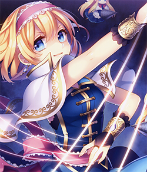

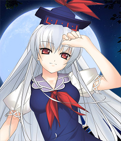

## Progress
- [x] **Design**
- [ ] **Program**
- [x] **Skins**
- [ ] **AI**

## Developing ...
 
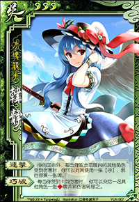

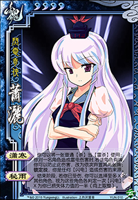

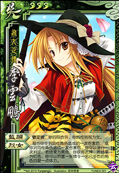
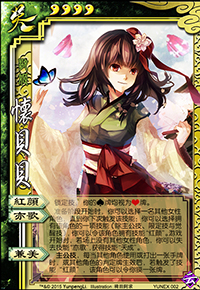
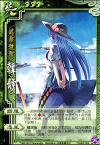

## SKINS
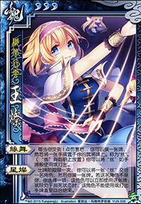
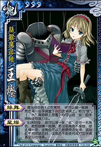
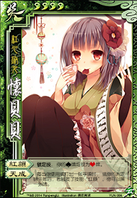

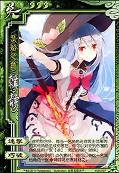
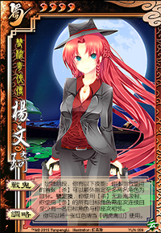
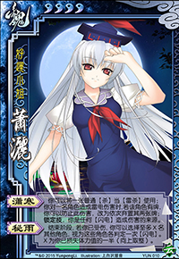
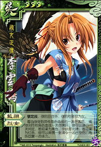
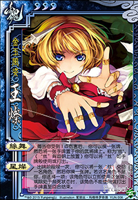
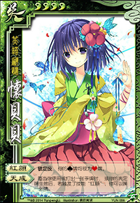
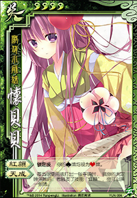
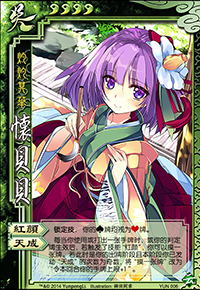
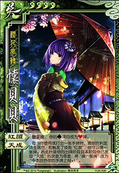

## AI

## AUDIO