# Yun
based on Qsanguosha-v2. I have designed some generals for my lovely XUEMEIs.Now I am programming, aimed to add these generals into Qsanguosha-v2.

 
 

# Now progress
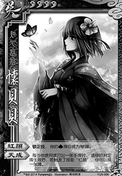 
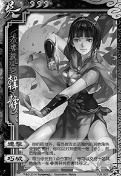

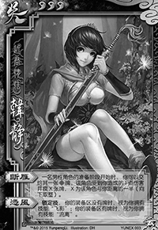

# Yun Package
 

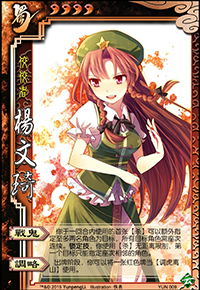

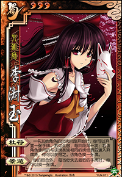

# EXYun Package

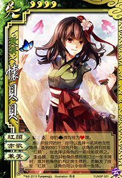

# Skins
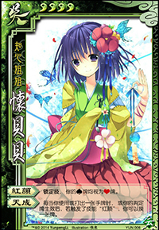
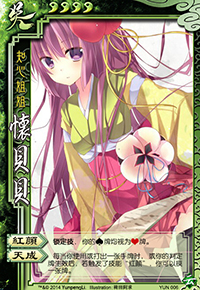
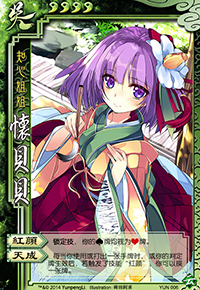
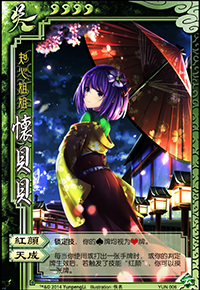
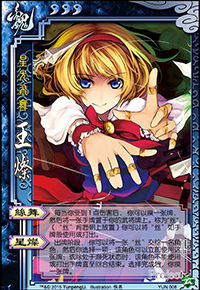
