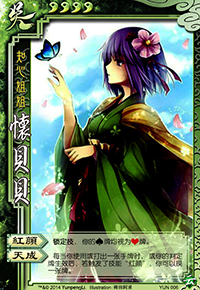
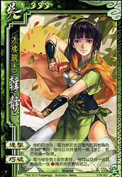
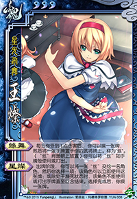
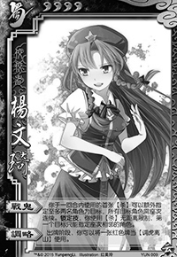
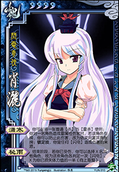
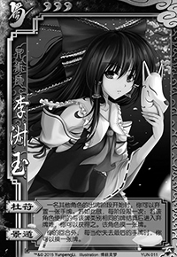
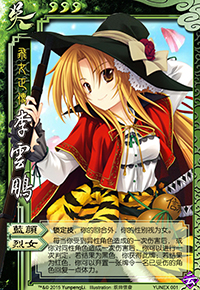
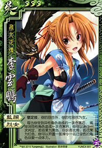
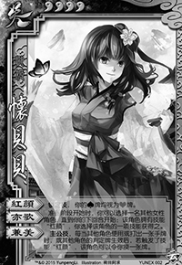
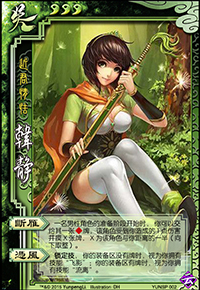

# Yun
Based on Qsanguosha-v2.https://github.com/Mogara/QSanguosha-v2

I have designed some generals for my lovely :blush: XUEMEIs.Now I am programming, aimed to add these generals into Qsanguosha-v2.

 

 

# Developing...
 

