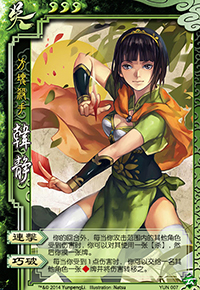
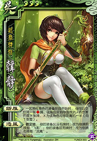

# Yun
Based on Qsanguosha-v2.https://github.com/Mogara/QSanguosha-v2

I have designed some generals for my lovely :blush: XUEMEIs.Now I am programming, aimed to add these generals into Qsanguosha-v2.

 

 

# general's LUA
## Developing ...
<<<<<<< HEAD
 

=======
 

>>>>>>> origin/master

<<<<<<< HEAD

=======

>>>>>>> origin/master

# AI

# SKINS

<<<<<<< HEAD
# ADUIO
=======
# ADUIO
>>>>>>> origin/master
